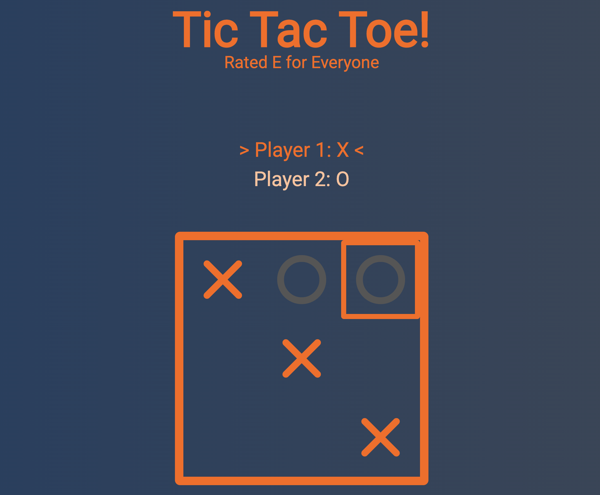

# Tic Tac Toe (revisited)

Roughly nine months ago, I made the Tic Tac Toe project for The Odin Project.
I want to try doing it again without looking at the code I wrote back then.

## About the Project

### Preview

    

### Live

<a href='http://google.com/'>Google</a>

### Objective

The goal of the project is to practice JavaScript and become more familiar with
OOP and project building. This includes writing down user stories, features,
flowcharts, architecture, and

###### Project Statement

<a href='http://theodinproject.com/'>The Odin Project</a> (Month Year)

### Features

- Start a game
- Play, taking turns
- Determine the outcome of a game
- Start a new game without reloading the page

## Built With

## To-Do

- [x] Understand the objectives
- [ ] Plan
  - [x] User Stories
  - [x] Features
  - [x] Flowchart
  - [x] Architecture
  - [x] UI Design
  - [x] Responsive Design
- [ ] Development
  - [x] Basic HTML
  - [x] Board Object
  - [x] Player Object
  - [x] Console Input
    - [x] Squares called 1-9
    - [x] Squares used once only
    - [x] Users alternate
  - [x] Find winner/outcome
    - [x] Stop game
    - [x] Declare winner
    - [x] Show winning row, column, or diagonal
  - [x] Offer Rematch
    - [x] Clear board
  - [ ] UI Features
    - [x] UI informs players whose turn it is
    - [x] Hovering over an available square lights it up
    - [ ] Clicking on a square gives the impression of depth
    - [x] A winning line lights up in a different color
    - [ ] A winning line seems to jump closer to the user
    - [x] A modal window opens to offer a rematch
  - [ ] Responsive Design
   - [ ] Media Queries
- [ ] Fix bugs
  - [ ] No bugs yet!

## User Stories

- As a user, I want to play Tic Tac Toe with another user
- As a user, I want to clearly see the winning row, column, or diagonal
- As a user, I want to clearly know when a draw has been reached
- As a user, I want to launch a new game after the game has concluded

## Features

- As a user, I want to play Tic Tac Toe with another user
- As a user, I want to clearly see the winning row, column, or diagonal
- As a user, I want to clearly know when a draw has been reached
- As a user, I want to launch a new game after the game has concluded

## Flowchart

Page Loads -> Board is created -> Two players are created -> X starts
-> players alternate -> clicking on an occupied square doesn't rewrite
nor does it switch players -> winner/draw is identified -> rematch offered ->
board cleared -> new game starts

## Architecture

Class Game

- constructor() {
  - Board [0, 1, 2, 3, 4, 5, 6, 7, 8]
  - Player 1
  - Player 2
  - currentPlayer  
    }
- init()
- offerRematch()
- clearBoard()
- printBoard()
- switchPlayer()
- declareOutcome(verdict)
- checkWin()
- playToken(position)
- simulateGame()

Class Player

- constructor() {
  - number
  - token  
    }

## Lessons & Difficulties

Formatting README.md is a pain.

## Diary

Some thoughts regarding the project
